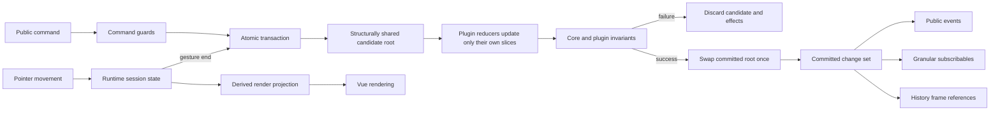

# Vue Board vNext

Status: proposed greenfield architecture  
Compatibility policy: hard cutover; no shims, dual paths, or deprecated aliases  
Primary goal: one understandable mutation model with atomic commits, honest types, and thin framework adapters

## Executive decision

vNext should not polish the current command/action/replay architecture. It should replace it.

The current library has a strong package concept, good documentation, useful domain tests, and an appropriately restrained first-party plugin boundary. Its main problem is that persistent change is represented several times:

1. commands mutate the engine state directly;
2. commands separately dispatch action records;
3. commands separately emit public events;
4. history inverts and replays the action records through a second mutation implementation;
5. connections reconstructs edge events by diffing its slice after actions;
6. Vue mirrors granular state and a full snapshot concurrently.

That duplication is the root of the hardest bugs and the largest files. It also explains the replay-priority table, scattered emit/dispatch pairs, batch rollback leaks, whole-map edge event diffing, and deprecated Vue snapshot path.

vNext will use one immutable, structurally shared document root and one atomic transaction kernel. A transaction creates a candidate root, records a change set, validates the candidate, swaps the root once, and only then publishes events and subscriptions. History stores references to committed roots instead of inverting actions. Runtime gestures use transient session state and commit one document change when the gesture ends.

This choice deliberately optimizes for the requirements the library has today: a local board engine with undo/redo, first-party optional features, persistence, and Vue rendering. It does not pay the architectural cost of an operation log for hypothetical collaboration.

## Non-negotiable outcomes

vNext is successful only if all of these are true:

- A failed command or batch publishes no state, event, history frame, plugin effect, or transient subscriber value.
- Every persistent state change passes through one transaction implementation.
- There is no action replay interpreter, action inversion layer, or replay-priority table.
- Explicit duplicate node and edge IDs are rejected before mutation.
- Runtime configuration is validated once at the boundary.
- Public types describe installed plugins and Vue component props honestly.
- `destroy()` is terminal and actually releases all engine-owned resources.
- Pointer movement does not clone or validate the entire document on every animation frame.
- Vue has one reactive path; the deprecated full-snapshot mirror is removed.
- Domain policy does not live in Vue components.
- The connection layer can be tested below the DOM-rendering boundary.
- There is one canonical JSON Canvas color-preset table.
- Every published package is linted, typechecked, tested, built, and consumer-tested.

## Design principles

### One source of truth per concept

- The committed document root is the source of truth for persisted board data.
- Session state is the source of truth for an active gesture, viewport measurements, snap guides, clipboard, and other runtime-only data.
- Rendered node geometry during a gesture is explicitly derived from the document root plus session state. It is rebuildable and never persisted independently.
- A transaction change set is a description of a successful commit, not a second writable model.
- Public persistent-state events are projections of a committed change set.

### Delete before abstracting

vNext deletes:

- action inversion;
- action replay;
- replay priority sorting;
- unused node version counters;
- the deprecated Vue snapshot mirror;
- duplicate edge and node color tables;
- the engine `ready` event;
- runtime plugin installation;
- public low-level interaction commands;
- `middleware` terminology;
- the standalone minimap package;
- compatibility aliases for renamed APIs.

### Keep the public engine flat

The public engine remains a flat, autocomplete-friendly facade. vNext will not introduce `engine.nodes.create()`, service locators, command registries, repositories, or a class hierarchy. Internal files are grouped by invariant and ownership, not one file per method.

### Keep plugins sealed

Plugins remain first-party infrastructure, not a general ecosystem contract. The implementation ABI may live at `@lupinum/board-core/internal`, but application documentation must not encourage custom plugins. vNext improves the type honesty of installed plugin APIs without promising ABI stability to third parties.

### Invalid states never become observable

Boundary validation always runs. Commit invariants always run before publication. A `warn` mode that knowingly commits invalid state is removed. Performance is achieved by making gestures transient and transactions structurally shared, not by allowing invalid state.

## Target conceptual model



## State model

### Committed document root

The kernel owns one immutable root reference:

```ts
interface BoardDocumentRoot {
  readonly camera: Camera
  readonly grid: GridSettings
  readonly nodes: ReadonlyMap<NodeId, BoardNode>
  readonly selection: ReadonlySet<NodeId>
  readonly nextZIndex: number
  readonly pluginSlices: ReadonlyMap<string, unknown>
}
```

The root is immutable by convention and construction:

- public node records are frozen;
- maps and sets are never exposed as mutable engine-owned instances;
- a transaction lazily clones only the collection it writes;
- unchanged collections retain reference identity across commits;
- plugin slices must be immutable values owned by their plugin reducer;
- arbitrary edge `data` is cloned once at the public boundary.

Camera, grid, and selection remain persisted because that is current document behavior. History does not blindly restore the entire document root. It captures a history root containing nodes, grid, selection, z-order, and history-enabled plugin slices while intentionally excluding camera. Undo therefore never jumps the user's current camera.

```ts
interface BoardHistoryRoot {
  readonly nodes: ReadonlyMap<NodeId, BoardNode>
  readonly grid: GridSettings
  readonly selection: ReadonlySet<NodeId>
  readonly nextZIndex: number
  readonly pluginSlices: ReadonlyMap<string, unknown>
}
```

This is not a second source of truth. It is a structurally shared reference snapshot created from a committed root and owned only by history frames.

### Runtime session state

Runtime state is separate because it has different persistence and history rules:

```ts
interface BoardSessionState {
  readonly viewportSize: Point
  readonly interaction: InteractionState
  readonly snapGuides: readonly SnapGuide[]
  readonly clipboard: readonly BoardNode[]
  readonly nodeOverrides: ReadonlyMap<NodeId, NodeGeometry>
}
```

`nodeOverrides` exists only during an active drag or resize. Effective nodes are derived from committed nodes plus overrides. The override map is cleared on commit, cancellation, import, or destruction. Invariant tests must prove that it can always be rebuilt from the interaction state or discarded without losing document data.

### Public runtime state

`BoardState` is the effective state consumers render. It may contain derived node geometry during an active gesture. `BoardDocument` is the persisted JSON Canvas representation. These names must never be used interchangeably.

```ts
interface BoardState {
  readonly camera: Camera
  readonly grid: GridSettings
  readonly nodes: ReadonlyMap<NodeId, BoardNode>
  readonly selection: ReadonlySet<NodeId>
  readonly interaction: InteractionState
  readonly snapGuides: readonly SnapGuide[]
}
```

`getSnapshot()` is removed. `getState()` is the one immutable runtime read. `exportDocument()` is the one persisted-document read.

## Transaction kernel

### Responsibilities

The transaction kernel owns exactly these responsibilities:

1. reject commands after destruction;
2. evaluate command guards;
3. create or join the current outer transaction;
4. expose typed mutation primitives to command implementations;
5. collect an ordered change set;
6. let installed plugins reduce relevant changes into their own slices;
7. validate the candidate root and plugin slices;
8. atomically swap the committed root;
9. publish subscriptions, events, and the internal commit notification;
10. discard everything on failure.

It does not own domain geometry, persistence parsing, Vue state, history inversion, or arbitrary middleware orchestration.

### Minimal internal API

```ts
interface BoardTransaction {
  readonly metadata: CommandMetadata
  getNode(id: NodeId): BoardNode | undefined
  setNode(node: BoardNode): void
  deleteNode(id: NodeId): void
  setSelection(ids: Iterable<NodeId>): void
  setGrid(grid: GridSettings): void
  setCamera(camera: Camera): void
  setNextZIndex(value: number): void
  getPluginSlice<S>(name: string): S
  setPluginSlice<S>(name: string, value: S): void
}
```

These methods lazily clone affected collections and append typed before/after facts to the change set. Commands do not mutate maps directly.

### Commit metadata

```ts
interface CommandMetadata {
  readonly name: string
  readonly history: 'record' | 'ignore'
  readonly source: 'api' | 'interaction' | 'history' | 'document-load'
}
```

There is no public `validate: false`. Internal session updates are not document transactions, so they do not need a validation escape hatch.

### Nested batches

`engine.batch()` joins the existing outer transaction. Nested commands do not commit, emit, notify, validate, or record history independently. Only the outer batch can publish.

```ts
const result = engine.batch(
  () => {
    const first = engine.createNode(...)
    const second = engine.createNode(...)
    return { first, second }
  },
  { label: 'create workflow' },
)
```

If any nested operation throws, the candidate root and queued effects are discarded. Subscribers observe neither the intermediate state nor a compensating rollback state.

### Change sets

Change sets are commit facts, not replay instructions:

```ts
interface BoardChangeSet {
  readonly nodes: readonly NodeChange[]
  readonly selection?: ValueChange<readonly NodeId[]>
  readonly grid?: ValueChange<GridSettings>
  readonly camera?: ValueChange<Camera>
  readonly pluginSlices: ReadonlyMap<string, ValueChange<unknown>>
}
```

They serve three purposes only:

- derive public events after commit;
- notify only the subscribables whose values changed;
- provide diagnostics and tests with an immutable summary.

History stores before/after history-root references, not change sets, because change sets would reintroduce inversion and dependency ordering.

## Commands and domain ownership

### Commands compute; transactions write

A command may perform complex domain planning—hierarchy closure, snapping, reparenting, z-order repair—but all writes go through `BoardTransaction`.

Node deletion is planned in dependency-safe order. Plugins see core changes inside the transaction and update their own slices before commit. Connections therefore removes incident edges atomically without an `onAction` side effect.

### Consolidate duplicated command bodies

The following pairs become one internal implementation:

- `moveNode` and `translateSelectedNodes` use `translateNodes(seeds, delta)`;
- drag completion uses the same translation planner;
- `bumpNodeToFront` and `bringToFront` use one z-order operation;
- node deletion and selected-node deletion use one forest-deletion planner;
- programmatic resize and gesture completion use one resize planner.

The public facade stays explicit. Internal reuse must delete behavior duplication, not create a generic command framework.

### Interaction commands become adapter-internal

The following are not normal application APIs and move to the sealed internal adapter surface used by `@lupinum/vue-board`:

- `beginPan`
- `beginNodeDrag`
- `beginResize`
- `beginBoxSelect`
- `updatePointer`
- `endInteraction`
- `getUniformTranslationTargets`
- `syncGroupZOrder`

Applications continue to use `BoardRoot`. The public engine retains meaningful domain commands such as `moveNode`, `resizeNode`, `select`, and camera operations.

### Gesture transactions

Continuous gestures no longer create persistent commits per pointer frame:

1. `begin*` captures immutable origins in session state.
2. `updatePointer` updates only the interaction, snap guides, and derived node overrides.
3. Vue and connection geometry render effective nodes from the derived projection.
4. `endInteraction` performs one document transaction using the final effective geometry.
5. cancellation clears session state without a document rollback.

This removes restore-point cloning, full validation, event spam, and timer-based history coalescing from the hottest path.

## History

### Replace inverse actions with structural snapshots

History is still an optional first-party plugin, but it observes successful commits rather than command lifecycle events and action streams.

```ts
interface HistoryFrame {
  readonly label: string
  readonly timestamp: number
  readonly before: BoardHistoryRoot
  readonly after: BoardHistoryRoot
}
```

Because roots use structural sharing, unchanged node and plugin maps are shared between frames. The history stack stores references, not deep copies of every document.

Undo atomically restores `before`; redo atomically restores `after`. Restoration:

- keeps the current camera and runtime session configuration;
- resets any active interaction;
- validates the restored history root;
- derives node, grid, selection, and plugin events from the restored roots;
- runs with `history: 'ignore'`;
- creates no replay actions and needs no action ordering.

Delete these concepts completely:

- `InternalBoardAction`
- `applyRecordedAction`
- `invertAction`
- feature action inverters
- `undoReplayPriority`
- `FEATURE_ACTION`
- action capture between `command:before` and `command:after`

### History boundaries are explicit

Remove timer-driven `debounceMs` history grouping. A completed gesture is one commit. A text edit is one commit. A public `batch()` is one commit. Programmatic callers that want several updates to undo together must use `batch()`.

This makes undo granularity deterministic and removes timers from domain behavior. `maxSteps` remains.

## Plugin model

### One vocabulary

Use **plugin** everywhere:

| Current                      | vNext                        |
| ---------------------------- | ---------------------------- |
| `extensions` option          | `plugins`                    |
| `BoardExtension`             | `BoardPlugin`                |
| `BoardFeatureExtensions`     | `BoardPluginApis`            |
| `InternalBoardFeature`       | `InternalBoardPlugin`        |
| `defineInternalBoardFeature` | `defineInternalBoardPlugin`  |
| `engine.ext`                 | `engine.plugins`             |
| `connectionPlugin()`         | `connectionsPlugin()`        |
| “extensions and middleware”  | “plugins and command guards” |

There are no deprecated aliases.

### Installed APIs are typed honestly

Module augmentation currently makes plugin APIs appear installed whenever a package is imported. vNext replaces that unsoundness with inference from the plugin tuple:

```ts
const engine = createBoardEngine({
  plugins: [historyPlugin(), connectionsPlugin()] as const,
})

engine.plugins.history.undo()
engine.plugins.connections.createEdge(...)
```

Conceptually:

```ts
interface BoardPlugin<TName extends string, TApi, TSlice = never> {
  readonly name: TName
  readonly api: TApi
  readonly __boardPluginBrand: never
}

function createBoardEngine<
  const TPlugins extends readonly BoardPlugin<string, unknown, unknown>[],
>(options: BoardEngineOptions<TPlugins>): BoardEngine<PluginApis<TPlugins>>
```

`BoardEngine` defaults to no plugin APIs. Framework adapters accept the non-plugin core engine surface, so generic plugin parameters do not infect ordinary component props. Packages may export convenience aliases such as `ConnectionsBoardEngine` where a plugin-specific API genuinely requires one.

### Internal plugin rules

- Plugin names must be unique; duplicates throw during construction.
- Plugins are installed only during engine creation.
- A plugin may mutate only its own slice.
- Plugin reducers run inside the transaction and may abort the commit by throwing.
- Plugin public events are derived from committed slice changes.
- Plugin cleanup is registered with engine destruction.
- Plugins may not depend implicitly on installation order.
- Cross-plugin dependencies are forbidden until a concrete first-party requirement exists.
- The core retains the explicit JSON Canvas edge check until a second plugin-owned document section exists; no generic capability registry is added for a set of size one.

### History and connections

- Connections owns one immutable persisted slice containing edges and next z-index.
- Connections reduces node-deletion change facts inside the transaction, removing incident edges atomically.
- History owns runtime stacks, not a persisted document slice.
- History observes committed root transitions through the sealed kernel API.

## Public API vNext

### Lifecycle and construction

```ts
const engine = createBoardEngine({
  camera: { x: 0, y: 0, z: 1 },
  grid: { size: 20, snap: true },
  plugins: [historyPlugin(), connectionsPlugin()] as const,
})
```

Construction is synchronous. The engine is ready when returned, so the engine-level `ready` event is deleted. `BoardRoot` keeps its component-level `ready` emit because DOM mounting and viewport measurement are asynchronous concerns.

`destroy()` is idempotent but terminal:

- active animations and gestures are cancelled;
- plugin cleanups run once;
- event, guard, commit, and subscribable listeners are released;
- timers and traces are cleared;
- future reads or commands, except repeated `destroy()`, throw `BoardDestroyedError`.

### State and persistence

```ts
engine.getState(): BoardState
engine.exportDocument(): JsonCanvasDocument
engine.loadDocument(input: unknown, options?: { mode?: 'replace' | 'merge' }): void
```

`exportJSON()` and `importJSON()` are removed. JSON encoding is not board behavior:

```ts
const json = JSON.stringify(engine.exportDocument())
engine.loadDocument(JSON.parse(json))
```

`loadDocument()` accepts `unknown`, validates the complete boundary, and commits atomically. Invalid input never partially replaces the board.

### Reactive channels

The engine exposes one channel per independently changing public concept:

```ts
engine.$camera
engine.$grid
engine.$nodes
engine.$selection
engine.$interaction
engine.$snapGuides
```

`$grid` eliminates Vue's dependence on a mirrored full snapshot. Subscriber callbacks receive the value from before the outer commit as `prev`, not the penultimate internal value.

### Duplication

Preserve source-to-clone identity:

```ts
interface DuplicateNodesResult {
  readonly nodes: readonly BoardNode[]
  readonly idMap: ReadonlyMap<NodeId, NodeId>
}

engine.duplicateNodes(ids, offset?): DuplicateNodesResult
```

Alt-drag uses `idMap.get(sourceId)`. Geometry matching in Vue is deleted.

### Lookups and errors

Keep the useful explicit lookup pair:

- `getNode(id)` throws `BoardNotFoundError`;
- `findNode(id)` returns `BoardNode | null`;
- `hasNode(id)` returns `boolean`.

Deletes remain idempotent. Updates and reads of missing entities throw. This asymmetry is documented as policy rather than allowed to emerge accidentally.

Command guards remain synchronous but lose middleware-style `next()` chaining:

```ts
type CommandGuard = (command: Readonly<CommandContext>) => true | string
```

Returning `true` permits the command. Returning a string blocks it and becomes the message on `CommandBlockedError`. A thrown guard error aborts the command unchanged. This is a policy list, not an orchestration pipeline.

### Diagnostics and listener errors

Diagnostics tracing is off by default. When enabled, traces contain immutable, bounded summaries rather than retained references to arbitrary command inputs.

Public event-listener failures do not roll back an already committed command. They are routed through a configured `onUnhandledError(error, context)` hook, with a conservative console fallback. Internal plugin reducer errors occur before commit and therefore abort atomically.

## Type model

### Nodes are a discriminated union

The persisted JSON Canvas types are already discriminated; runtime nodes should be equally honest:

```ts
interface BoardNodeBase {
  readonly id: NodeId
  readonly x: number
  readonly y: number
  readonly width: number
  readonly height: number
  readonly color?: CanvasColor
  readonly zIndex: number
  readonly locked: boolean
  readonly visible: boolean
  readonly parentId?: NodeId
}

type BoardNode =
  | (BoardNodeBase & { readonly type: 'text'; readonly text: string })
  | (BoardNodeBase & {
      readonly type: 'file'
      readonly file: string
      readonly subpath?: string
    })
  | (BoardNodeBase & { readonly type: 'link'; readonly url: string })
  | (BoardNodeBase & {
      readonly type: 'group'
      readonly label?: string
      readonly background?: string
      readonly backgroundStyle?: JsonCanvasBackgroundStyle
    })
```

`NodeInput` follows the same union while keeping `type?: 'text'` as the default text-node branch. `NodePatch` is type-aware: updating a text node cannot accept `file`, and a group patch cannot accept `url`.

### IDs

Keep branded `NodeId` and `EdgeId`. Keep `asNodeId` and `asEdgeId` explicitly documented as compile-time casts, not validators. DOM dataset strings are converted at one adapter boundary, not cast throughout interaction code.

### Remove cast-shaped contracts

Delete the `never`/`unknown` cast pattern around plugin slice reducers and inverters. Plugin slices are generic over their actual state. Since action inversion is removed, a large class of casts disappears automatically.

### Vue declarations

Export SFCs directly:

```ts
export { default as BoardRoot } from './components/BoardRoot.vue'
```

Do not annotate them as generic `Component`. Generated declarations must retain props, emits, and slots. Public type tests assert real props and invalid props, not mere assignability to `Component`.

## Vue architecture

### BoardRoot is a convenience facade, not a second engine

`BoardRoot` continues to provide the default grid, viewport, nodes, toolbar, snap guides, box selection, keyboard handling, and pointer handling. This preserves the five-minute path to a working board.

It no longer mirrors `engine.getSnapshot()`:

- each engine subscribable maps to one `shallowRef`;
- `$grid` replaces snapshot-based grid reads;
- the deprecated `snapshot` context field is deleted;
- `scheduleSnapshotRefresh` and the `command:after` refresh hook are deleted;
- the debug slot receives a lazy `state` computed from `engine.getState()` only when consumed.

The engine prop remains stable after mount. Changing the prop at runtime is either explicitly unsupported or implemented as a real teardown/rebind operation; it is not half-reactive.

### Optional default chrome

Do not redesign `BoardRoot` into a fully headless component kit. Add direct opt-outs for bundled chrome that real consumers may replace:

```ts
interface BoardRootProps {
  selectionToolbar?: boolean
  grid?: boolean | BoardGridOptions
  snapGuides?: boolean
  boxSelect?: boolean
}
```

No generic “features” configuration object is introduced.

### Connection layer

`BoardConnectionLayer` currently mixes five ownership domains. vNext splits it by real seams:

```text
board-connections/src/vue/
  BoardConnectionLayer.vue       # public render shell
  ConnectionSvgLayer.vue         # paths, markers, hit targets
  ConnectionToolbar.vue          # selected-edge commands and menus
  ConnectionLabel.vue            # display/edit behavior
  useConnectionInteraction.ts    # hover, drag, reconnect, create state
  connection-hit-testing.ts      # pure spatial decisions
```

Rules:

- Directionality mapping lives in the model package, shared by defaults and toolbar commands.
- Hit-testing is pure and unit-tested without mounting Vue.
- The interaction composable produces intents; domain mutation goes through the connections API.
- The render shell contains no edge policy tables.
- The component uses the `BoardRoot` context engine only. The misleading optional `engine` prop is deleted so edges cannot come from one engine while nodes and camera come from another.
- Cross-feature gesture exclusivity is enforced by the shared internal interaction coordinator. It does not require adding edge-specific variants to the public `InteractionState` union.

### Minimap

Delete `@lupinum/vue-board/minimap` as a standalone package. A minimap is derived Vue UI with no independent domain state or external dependency. Move it to:

```text
@lupinum/vue-board/minimap
```

The subpath exports `useMinimap` and `BoardMinimap`. This preserves optional imports and tree-shaking while removing a package, release unit, peer-dependency manifest, build configuration, and duplicated README.

## Connections package

Keep connections optional, but separate the headless model from Vue evaluation:

```text
@lupinum/board-connections       # plugin, types, commands, geometry
@lupinum/board-connections/vue   # BoardConnectionLayer and Vue interaction
```

The root entrypoint must not import Vue. Vue peers can be optional for consumers using only the headless connections plugin.

Suggested source layout:

```text
packages/board-connections/src/
  index.ts
  model/
    types.ts
    state.ts
    commands.ts
    persistence.ts
    directionality.ts
    colors.ts
  geometry/
    anchors.ts
    bezier.ts
    orthogonal.ts
    straight.ts
    arc.ts
    index.ts
  vue/
    index.ts
    BoardConnectionLayer.vue
    ConnectionSvgLayer.vue
    ConnectionToolbar.vue
    ConnectionLabel.vue
    useConnectionInteraction.ts
    connection-hit-testing.ts
```

This is not a request to split every routing helper into a file mechanically. The listed files are ownership targets; small routing implementations may remain grouped where that reads better.

## Core source layout

Split by invariant and dependency direction, not one command per file:

```text
packages/board-core/src/
  index.ts
  types.ts
  colors.ts
  math.ts
  hierarchy.ts
  resize.ts
  snap.ts
  engine/
    createBoardEngine.ts      # composition root and flat public facade
    transaction.ts            # candidate root, change set, commit/abort
    state.ts                  # document/session roots and defaults
    events.ts                 # committed-change projection and runtime events
    subscribables.ts          # granular public streams
    guards.ts                 # simple policy predicates
    plugins.ts                # sealed installation and slice ownership
    validation.ts             # core invariants
  commands/
    nodes.ts                  # CRUD, hierarchy, z-order, duplicate
    selection.ts              # selection and clipboard policy
    camera.ts                 # pan, zoom, fit
    document.ts               # load/export orchestration
  interaction/
    controller.ts             # runtime gesture lifecycle
    projection.ts             # effective nodes from root + overrides
  persistence/
    json-canvas.ts            # parse, normalize, encode
  internal.ts
```

`createBoardEngine.ts` should read as composition, not as the implementation of every domain rule. Command groups receive narrow dependencies such as `readState`, `transact`, and geometry helpers. Do not pass one untyped god-context object and do not add a command registry.

File size is not an acceptance criterion by itself. The criterion is whether a module owns one describable invariant and can be tested without importing unrelated behavior. As a review trigger, a file approaching 1,000 lines must justify why extraction would increase rather than reduce the mental model.

## Colors

JSON Canvas presets have one canonical table in `board-core`:

```ts
BOARD_COLOR_PRESETS
```

Nodes and edges use the same preset semantics. If edge strokes need a visually adjusted value, derive it through a named resolver from the canonical preset. Do not fork IDs, labels, and hex values into another table.

## Boundary validation and errors

### Constructor validation

Reject invalid options before allocating plugins or listeners:

- camera values must be finite and `z > 0`;
- zoom limits must be finite, positive, and `min <= max`;
- grid size, major interval, and edge-snap threshold must be finite and positive;
- node minimum and default dimensions must be finite, positive, and internally consistent;
- box-select behavior and grid pattern must be supported values;
- diagnostics limits must be non-negative integers;
- plugin names must be unique;
- initial nodes must have unique IDs and valid parent/z-order relationships.

### Entity validation

- `createNode` and `createEdge` reject explicit duplicate IDs.
- Node and edge endpoints are validated before the transaction writes.
- Anchors validate side and finite offset in `0..1` rather than silently clamping persisted data.
- Colors use validated preset or hex types at runtime boundaries.
- Merge import remapping is explicit and returned where a caller needs it.

### Error taxonomy

Keep the taxonomy small:

```ts
BoardError
  BoardInputError
  BoardNotFoundError
  BoardConflictError       # duplicate IDs and incompatible ownership
  CommandBlockedError
  BoardDestroyedError
```

Messages include the operation and relevant entity ID. Tests assert error class and stable message fragments, not full incidental prose.

## Persistence

Keep JSON Canvas plus `x-vue-board`; it is one of the strongest current decisions.

Changes for vNext:

- `exportDocument()` returns the typed canonical document object.
- `loadDocument(unknown)` performs normalization and validation.
- Runtime fields remain forbidden at the JSON Canvas top level.
- Plugin codecs contribute only their owned document data.
- Loading a document containing edges without the connections plugin fails before mutation.
- Replace and merge are both atomic transactions.
- Merge returns an explicit node ID map if exposed as a lower-level utility; identity is never re-derived from geometry.
- Import failure during plugin decoding performs cleanup for every plugin already installed during construction.

## Comments and documentation style

### Source comments

Comments should explain one of:

- why an ordering constraint exists;
- which invariant a non-obvious branch protects;
- why a simpler-looking alternative is wrong;
- provenance or license obligations for imported algorithms;
- the public behavioral contract.

Comments should not narrate the next line, preserve dead design history, or describe speculative future uses. Public exports receive JSDoc when it materially improves generated IntelliSense. Internal obvious helpers do not need ceremonial comments.

### Architecture documentation

Replace the current architecture document after the cutover; do not maintain v1 and vNext architecture descriptions side by side. The final `ARCHITECTURE.md` must explain:

- document root versus session state;
- transaction publication ordering;
- plugin slice ownership;
- history snapshots;
- persistent versus runtime events;
- Vue adapter boundaries;
- one traced node drag and one traced failed batch.

### User documentation

Add explicit reference tables for:

- which operations throw, return `null`, or no-op;
- command-guard behavior and `CommandBlockedError`;
- lifecycle and destruction;
- persisted document state versus runtime state;
- installed plugin typing;
- document load errors;
- batch atomicity.

Compile or execute extracted TypeScript examples. Fix examples that use `.length` on `ReadonlySet`; documentation tests must validate semantics, not only grep for stale strings.

## Testing strategy

### Kernel invariant tests

The transaction kernel must prove:

1. a failed command publishes nothing;
2. a failed nested batch publishes nothing;
3. a successful batch notifies each affected subscribable once;
4. subscriber `prev` is the value before the outer commit;
5. plugin reducer failure aborts core and every plugin slice;
6. public listener failure cannot corrupt committed state;
7. duplicate IDs never overwrite state;
8. destroyed engines cannot be used;
9. an undo or redo is one atomic commit;
10. history restoration preserves the current camera;
11. transient gesture overrides never enter exported documents;
12. cancelling a gesture leaves the document root unchanged.

Transaction and root-restoration branches require complete branch coverage. Overall coverage is monitored, but no arbitrary percentage substitutes for invariant tests.

### Property tests

Add randomized properties for:

- arbitrary command sequences preserve node, parent, z-order, and edge invariants;
- `command → undo → state equality`;
- `undo → redo → state equality`;
- failed command sequences leave root identity unchanged;
- duplicate/merge/import sequences never lose an existing entity silently;
- every edge endpoint references an existing node after any committed transaction;
- derived gesture projections equal the committed result at gesture completion.

### Type tests

Consumer type tests must prove:

- plugin APIs exist only when their plugins are installed;
- `BoardRoot` props, emits, and slots retain their generated types;
- invalid node-specific fields are rejected;
- core internal interaction APIs are not exported publicly;
- packed packages work with `skipLibCheck: false` where feasible;
- Nuxt auto-import lists remain in parity with the intended Vue public surface.

### UI tests

- Test connection hit-testing and gesture state without the DOM.
- Keep component tests for rendering contracts and integration only.
- Avoid locking tests to exact inline opacity or marker values unless those are intentional public visual contracts.
- Split test files by behavior when a reader cannot identify the relevant setup quickly.
- Run screenshot tests in one declared Linux container matching CI; store one canonical platform baseline rather than macOS-only images.

### Tooling gates

Every published package is included in:

- Prettier check;
- ESLint;
- TypeScript/vue-tsc;
- unit tests;
- build;
- packed consumer import and typecheck;
- dependency audit.

Declare supported Node versions and align `@types/node` with the minimum CI/runtime contract. A typecheck that prints a missing Volar plugin error is not considered clean even if it exits zero.

## Package layout

Target workspace:

```text
packages/
  board-core
  vue-board
  board-history
  board-connections
  nuxt-board
apps/
  playground
  docs
```

`board-minimap` is absorbed into the `vue-board/minimap` subpath. No new package is introduced for transaction, interaction, or plugin infrastructure.

## Hard-cutover API changes

| v1                                      | vNext                                    |
| --------------------------------------- | ---------------------------------------- | ------ | -------------------- |
| `extensions`                            | `plugins`                                |
| `engine.ext`                            | `engine.plugins`                         |
| `BoardExtension`                        | `BoardPlugin`                            |
| `connectionPlugin()`                    | `connectionsPlugin()`                    |
| globally augmented required plugin APIs | plugin-tuple inferred APIs               |
| `getSnapshot()`                         | removed; use `getState()`                |
| `exportJSON()`                          | `exportDocument()`                       |
| `importJSON(json, mode)`                | `loadDocument(unknown, { mode })`        |
| `duplicateNodes(): BoardNode[]`         | `duplicateNodes(): DuplicateNodesResult` |
| public pointer interaction methods      | sealed adapter API                       |
| engine `ready` event                    | removed                                  |
| `validation: 'strict'                   | 'warn'                                   | 'off'` | always-valid commits |
| history `debounceMs`                    | explicit gesture/batch boundaries        |
| `@lupinum/vue-board/minimap`                | `@lupinum/vue-board/minimap`             |
| `@lupinum/board-connections` Vue export | `@lupinum/board-connections/vue`         |

No alias packages, forwarding functions, compatibility overloads, feature flags, or migration runtime are added. Documentation and examples change in the same cutover.

## Implementation sequence

Each phase ends with a hard cutover and deletion. Do not leave old and new mutation paths active together.

### Phase 0: lock the contract with failing tests

Before structural work, add tests demonstrating the required vNext behavior:

- failed-batch event/subscription isolation;
- duplicate-ID rejection;
- configuration validation;
- terminal destruction;
- exact component declarations;
- plugin-installation type honesty;
- alt-drag identity mapping;
- canonical colors.

These tests should fail on v1 for the intended reasons.

### Phase 1: delete dead and duplicate concepts

- Delete node version counters and collapse `StoredNode` where possible.
- Unify color presets.
- Rename extension vocabulary to plugin vocabulary.
- Change duplicate-node return identity.
- Restore exact Vue component exports.
- Add `$grid` and remove the Vue snapshot mirror.
- Delete the core `ready` event.

This phase reduces noise before the kernel rewrite.

### Phase 2: replace the mutation kernel

- Introduce immutable document/session roots and the transaction builder.
- Port core commands by invariant group.
- Project public persistent events from committed change sets.
- Make nested batches one transaction.
- Add constructor/entity validation and error classes.
- Make destruction terminal.
- Delete direct map writes from command implementations.

Once the last core command is ported, delete the old restore-point, dispatcher, and validation-mode paths immediately.

### Phase 3: replace history

- Implement structural history roots and root restoration.
- Make gesture and batch boundaries explicit.
- Port history tests to state equality and atomic events.
- Delete actions, inversion, replay, coalescing timers, and priority sorting in the same change.

Do not ship a release containing both history systems.

### Phase 4: port plugins

- Add typed plugin-tuple inference.
- Move connections state updates into its immutable slice reducer.
- Make node/edge cascading transactional.
- Derive edge events from committed slice changes.
- Reject duplicate plugin and edge IDs.
- Remove module augmentation and action listeners.

### Phase 5: make gestures transient

- Add session overrides and effective-node projection.
- Port Vue pointer interaction to the sealed adapter API.
- Commit one transaction per completed gesture.
- Remove per-pointer document commits and history debounce assumptions.
- Benchmark 2,000 nodes and representative edge counts.

### Phase 6: decompose connection UI

- Extract shared directionality policy.
- Extract pure hit-testing.
- Extract interaction composable.
- Extract label and toolbar components.
- Delete the connection layer `engine` prop.
- Move Vue exports to the `/vue` subpath.

### Phase 7: simplify packages and finish the public cutover

- Move minimap into `vue-board/minimap` and delete the package.
- Update Nuxt explicit auto-import lists and add parity tests.
- Rewrite docs and examples against vNext only.
- Replace `ARCHITECTURE.md` with the implemented architecture.
- Generate Linux visual baselines.
- Run the complete release matrix and pack checks.

## Acceptance criteria

### Architecture

- Persistent writes occur only through `BoardTransaction` primitives.
- No source file contains action inversion or replay code.
- Plugins mutate only their own immutable slices inside a transaction.
- Public persistent events originate from one committed-change projector.
- Vue contains no domain identity reconstruction, directionality tables, or document rollback logic.

### Behavior

- Failed commands and batches produce zero public effects.
- Undo/redo restores core and connections state atomically.
- Camera position survives undo/redo.
- Active gestures export only committed document data.
- Duplicate IDs, invalid configuration, malformed documents, and invalid plugin state fail before publication.
- `destroy()` releases resources and prevents subsequent use.

### Types

- Generated `BoardRoot` declarations expose real props, emits, and slots.
- `createBoardEngine()` without connections has no typed `plugins.connections` property.
- Node-specific data is narrowed by `node.type` without casts.
- No public API requires `any` to express a normal plugin or Vue use case.

### Maintainability

- The engine composition root reads as assembly and policy, not 50 command implementations.
- Connection interaction logic is unit-testable without mounting Vue.
- No deprecated path remains.
- No concept uses extension/plugin/feature/middleware interchangeably.
- One color table defines preset semantics.
- Nuxt export parity is enforced by tests.

### Verification

- formatting, lint, full typecheck, unit, docs, build, pack, and dependency-audit checks pass;
- kernel invariant and property tests pass;
- Linux visual tests pass from a clean checkout;
- the packed consumer test uses the generated declarations, not workspace source aliases;
- no generated declaration contains local absolute paths;
- no non-fatal missing-plugin or module-resolution warnings remain.

## Rejected alternatives

### Keep direct mutation and merely add more rollback tests

Rejected because it preserves separate command mutation, replay mutation, event emission, and plugin observation paths. Tests can detect divergence but cannot remove the causes.

### Make actions the permanent collaborative operation log

Rejected for vNext because collaboration, conflict resolution, and remote operation replay are not current requirements. Designing local undo around hypothetical networking keeps inversion and ordering complexity alive. A future collaboration layer can define its own explicit operation protocol above committed commands.

### Deep-copy full snapshots for history

Rejected because it scales memory with the entire document per frame. Structurally shared immutable roots deliver snapshot semantics without repeated deep copies.

### Use Immer or another state library

Rejected unless implementation profiling proves the small transaction builder insufficient. Core currently has no runtime dependencies, and the required copy-on-write surface is limited to a few maps and value objects.

### Split every engine command into its own file

Rejected because it would create a registry or god context and scatter shared invariants. Files are grouped by domain ownership: nodes, selection, camera, document, and interaction.

### Turn plugins into a public third-party ecosystem API

Rejected because it would freeze transaction, slice, and persistence internals prematurely. vNext keeps the ABI sealed while making first-party installation types honest.

### Keep module augmentation for convenience

Rejected because it asserts plugin APIs exist when runtime installation is absent. Greenfield code should prefer truthful inference over globally convenient unsoundness.

### Add compatibility aliases

Rejected because the library is greenfield. Aliases would create two vocabularies and two API paths immediately after spending a major version to remove them.

### Build a generic persisted-field capability registry

Rejected until a second plugin-owned JSON Canvas document section exists. The explicit edge ownership rule remains simpler today.

## Deliberately retained decisions

- JSON Canvas plus `x-vue-board` remains the persistence format.
- The public engine remains a flat facade.
- The engine remains factory-created rather than class-based.
- Plugins remain optional and first-party.
- Core remains framework-agnostic and dependency-free.
- `BoardRoot` remains a batteries-included starting point.
- `getNode`/`findNode`/`hasNode` remain separate explicit lookup modes.
- Deletes remain idempotent.
- Documentation remains hand-written and contract-tested rather than generated as raw API listings.
- Explicit Nuxt auto-import lists remain, backed by parity tests rather than build-time reflection.

## Final standard

vNext should feel smaller even if the refactor is large.

The success metric is not that code moved into more files. It is that a contributor can answer these questions without tracing several parallel systems:

- Where does persisted state live? In one committed document root.
- How does state change? Through one atomic transaction.
- When do observers hear about it? After a successful commit.
- How does undo work? By restoring structurally shared history roots.
- Where do edges live? In the connections plugin's owned slice.
- What does Vue own? DOM input translation, transient rendering, and presentation.
- What happens on failure? Nothing becomes observable.

If the implementation cannot preserve those answers, it is not vNext yet.
